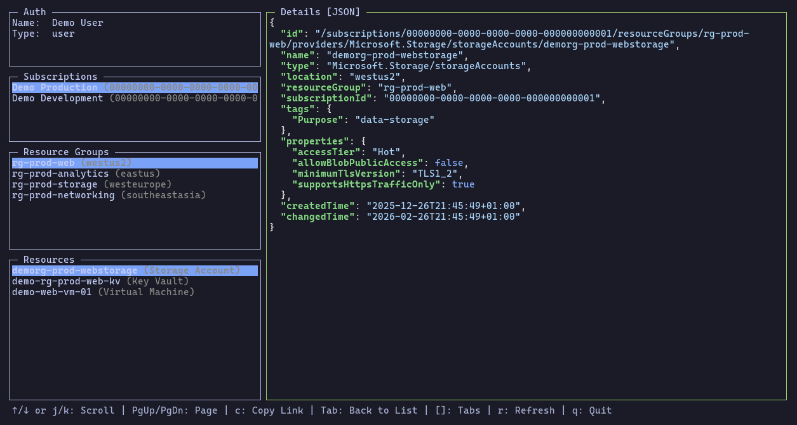

# LazyAzure

A TUI application for Azure resource management, inspired by [lazydocker](https://github.com/jesseduffield/lazydocker). Browse Azure subscriptions, resource groups, and resources with an interactive terminal interface.

> **About This Project**: This project is vibe-coded with [OpenCode](https://opencode.ai). It is provided as-is without warranties ([MIT License](./LICENSE)). See [AGENTS.md](AGENTS.md) for development guidelines.



## Features

- **Full Resource Hierarchy**: Browse Subscriptions → Resource Groups → Resources
- **Multiple Authentication Methods**: Supports Azure CLI, Managed Identity, Environment Variables, and more
- **Rich Detail Views**: 
  - Summary view with color-coded keys and formatted nested properties
  - JSON view with syntax highlighting
  - Scrollable content for long resource details
- **Intuitive Navigation**: 
  - Tab/Shift+Tab to cycle between panels
  - Enter to drill down hierarchy
  - Visual focus indicators (green border on active panel)
- **Copy portal link**: Copy link to subscription, resource group or resource to clipboard
- **Smart Resource Loading**: Fetches full resource details with provider-specific API versions
- **Real-time Updates**: Refresh data without restarting the application

See [PLAN.md](./PLAN.md) for implementation details and roadmap.

## Installation

### Prerequisites

### System Requirements

- **Go**: 1.26.1+ (only needed to install from source)
- **Terminal**: Modern terminal with Unicode and 256-color support (IDE consoles not recommended). Some recommendations:
  - MacOS:Ghostty, iTerm2, Terminal.app
  - Linux: Ghostty, Alacritty, Kitty, etc.
  - Windows: Windows Terminal

### Azure Requirements

- Azure account with appropriate permissions
- Azure CLI installed (optional, for `az login` convenience method)

### Install Pre-built Binaries

Download the latest binary for your platform from the [releases page](https://github.com/matsest/lazyazure/releases/latest).

**macOS (Apple Silicon):**
```bash
curl -LO https://github.com/matsest/lazyazure/releases/download/v0.1.0/lazyazure_0.1.0_darwin_arm64
chmod +x lazyazure_0.1.0_darwin_arm64
sudo mv lazyazure_0.1.0_darwin_arm64 /usr/local/bin/lazyazure
```

**Linux:**
```bash
curl -LO https://github.com/matsest/lazyazure/releases/download/v0.1.0/lazyazure_0.1.0_linux_amd64
chmod +x lazyazure_0.1.0_linux_amd64
sudo mv lazyazure_0.1.0_linux_amd64 /usr/local/bin/lazyazure
```

**Windows:** Download `lazyazure_0.1.0_windows_amd64.exe` from the releases page and add it to your PATH.

**Verify Checksum (optional):**
```bash
# Download checksums file and verify
curl -LO https://github.com/matsest/lazyazure/releases/download/v0.1.0/lazyazure_0.1.0_checksums.txt
sha256sum -c lazyazure_0.1.0_checksums.txt
```


### Install from Source

```bash
go install github.com/matsest/lazyazure@latest
```

Or clone and build:

```bash
git clone https://github.com/matsest/lazyazure.git
cd lazyazure
go build .
```

## Usage

### Quick Start

1. **Authenticate** (choose one method):
   ```bash
   # Option A: Azure CLI (easiest for local development)
   az login
   
   # Option B: Environment variables
   export AZURE_CLIENT_ID="your-client-id"
   export AZURE_CLIENT_SECRET="your-client-secret"
   export AZURE_TENANT_ID="your-tenant-id"
   ```

See other methods under [authentication](#Authentication).

2. **Run lazyazure**:
   ```bash
   ./lazyazure
   ```

### Controls

**Navigation:**
- **↑ / ↓** or **j / k**: Navigate items in current panel
- **Tab**: Switch focus forward between panels (Subscriptions → Resource Groups → Resources → Details)
- **Shift+Tab**: Switch focus backward between panels (Details → Resources → Resource Groups → Subscriptions)
- **Enter** (on subscription): Load resource groups for that subscription
- **Enter** (on resource group): Load resources in that resource group
- **Enter** (on resource): View resource details and focus right panel

**View Controls:**
- **[ / ]**: Switch between Summary and JSON tabs
  - Summary: Color-coded keys (green) with formatted values
  - JSON: Syntax highlighted with proper formatting
- **↑ / ↓** or **j / k** (in details panel): Scroll content up/down
- **PgUp / PgDn**: Scroll content by page
- **r**: Refresh current data

**Application:**
- **q** or **Ctrl+C**: Quit
- **c**: Copy portal link to clipboard

## Authentication

LazyAzure uses Azure's `DefaultAzureCredential` which automatically tries multiple authentication methods in order:

1. **Environment Variables** - Set `AZURE_CLIENT_ID`, `AZURE_CLIENT_SECRET`, and `AZURE_TENANT_ID`
2. **Managed Identity** - Automatic authentication when running in Azure (VMs, containers, etc.)
3. **Azure CLI** - Run `az login` (convenient for local development)
4. **Azure PowerShell** - Uses PowerShell credentials if available
5. **Visual Studio Code** - Uses VS Code Azure extension credentials
6. **Azure Developer CLI** - Uses `azd` credentials

For most users, simply run `az login` before starting lazyazure.

## Demo Mode

LazyAzure includes a demo mode that runs with mock Azure data - no Azure credentials required! This is perfect for:
- Creating GIFs or screenshots for documentation
- Testing the UI without a real Azure subscription
- Demonstrating features to users

To run in demo mode:

```bash
LAZYAZURE_DEMO=1 ./lazyazure
```

Demo mode provides:
- 2 mock subscriptions (Demo Production & Demo Development)
- 4 resource groups per subscription with various locations
- Multiple resource types (Storage Accounts, Key Vaults, VMs, SQL Databases, Load Balancers)
- Realistic nested properties and tags
- Simulated API response times for authentic feel

All data in demo mode is completely fake and safe to display publicly.

## Debug Logging

To enable debug logging for troubleshooting, set the `LAZYAZURE_DEBUG` environment variable:

```bash
LAZYAZURE_DEBUG=1 ./lazyazure
```

Debug logs are written to `~/.lazyazure/debug.log`.

To view logs:
```bash
cat ~/.lazyazure/debug.log
```

## Cross-Platform Support

- **Linux**: Full support
- **macOS**: Full support
- **Windows**: Good support (recommend Windows Terminal; classic CMD/PowerShell not recommended)

Linux clipboard requires `xclip` or `xsel` (X11) or `wl-copy` (Wayland). macOS and Windows have native clipboard support. If using WSL it should pick up the Windows clipboard.

## Architecture

```
lazyazure/
├── main.go                       # Entry point
├── PLAN.md                       # Full implementation plan
├── pkg/
│   ├── azure/
│   │   ├── client.go            # Azure SDK wrapper
│   │   ├── factory.go           # Client factory for dependency injection
│   │   ├── subscriptions.go     # Subscription operations
│   │   ├── resourcegroups.go    # Resource group operations
│   │   └── resources.go         # Generic resource operations
│   ├── demo/
│   │   ├── client.go            # Demo client (mock Azure data)
│   │   └── data.go              # Demo data structures
│   ├── domain/
│   │   ├── user.go              # User domain model
│   │   ├── subscription.go      # Subscription domain model
│   │   ├── resourcegroup.go     # ResourceGroup domain model
│   │   └── resource.go          # Generic Resource domain model
│   ├── resources/
│   │   ├── display_names.go     # Resource type display name loader
│   │   ├── display_names.json   # Human-readable resource type mappings
│   │   └── display_names_test.go # Display name tests
│   ├── gui/
│   │   ├── gui.go               # Main TUI controller
│   │   ├── interfaces.go        # Client interfaces
│   │   └── panels/
│   │       └── filtered_list.go # Generic filtered list
│   ├── tasks/
│   │   └── tasks.go             # Async task management
│   └── utils/
│       ├── logger.go            # Debug logging utility
│       ├── clipboard.go         # Clipboard operations
│       ├── portal_urls.go       # Azure Portal URL generation
│       └── portal_urls_test.go  # Portal URL tests
```

## Project Status

- **Phase 1 (MVP)**: ✅ Complete - Auth & subscriptions working
- **Phase 2**: ✅ Complete - Resource groups with stacked layout
- **Phase 3**: ✅ Complete - Resources browser with 3-level hierarchy
- **Phase 4**: 📝 Planned - Polish & advanced features

See [PLAN.md](./PLAN.md) for the full implementation roadmap.

## Dependencies

- [gocui](https://github.com/jesseduffield/gocui) - TUI framework
- [Chroma](https://github.com/alecthomas/chroma) - Syntax highlighting for JSON
- Azure SDK for Go:
  - `azidentity` - Authentication
  - `azcore` - Core types
  - `armsubscriptions` - Subscription management
  - `armresources` - Resource management

## Security

LazyAzure uses Microsoft's official [Azure SDK for Go](https://github.com/Azure/azure-sdk-for-go) with DefaultAzureCredential for authentication, supporting Azure CLI, Azure PowerShell, Managed Identity, environment variables, and other official Azure authentication methods. The application does not store credentials or sensitive data to disk; all tokens are handled in-memory only during runtime. No telemetry or logs is collected. Communication with Azure APIs uses HTTPS/TLS exclusively. [Debug logging](#debug-logging) is disabled by default and can be enabled via the `LAZYAZURE_DEBUG`` environment variable, which optionally logs to a local file in a users home directory. The repository is open source ([MIT License](./LICENSE)) and uses [Dependabot](./.github/dependabot.yml) for automated dependency/security updates and GitHub's [CodeQL](https://docs.github.com/en/code-security/concepts/code-scanning/codeql/about-code-scanning-with-codeql) for security analysis.

## Contributing

Found a bug or have a feature idea? We welcome your feedback!

- **Bug reports**: [Open an issue](../../issues/new?template=bug_report.md) with details about the problem, your environment, and steps to reproduce
- **Feature requests**: [Open an issue](../../issues/new?template=feature_request.md) describing the feature and your use case

Please check [existing issues](../../issues) first to avoid duplicates.

## License

[MIT](LICENSE)
